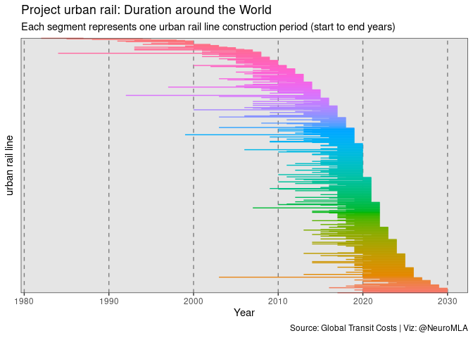

Let's load the data for this week:


```r
tuesdata <- tidytuesdayR::tt_load(2021, week = 2)
```

```
## 
## 	Downloading file 1 of 1: `transit_cost.csv`
```

```r
transit_cost <- tuesdata$transit_cost
```

Let's take a look at the data:


```r
head(transit_cost)
```

```
## # A tibble: 6 x 20
##       e country city  line  start_year end_year    rr length tunnel_per
##   <dbl> <chr>   <chr> <chr> <chr>      <chr>    <dbl>  <dbl> <chr>     
## 1  7136 CA      Vanc… Broa… 2020       2025         0    5.7 87.72%    
## 2  7137 CA      Toro… Vaug… 2009       2017         0    8.6 100.00%   
## 3  7138 CA      Toro… Scar… 2020       2030         0    7.8 100.00%   
## 4  7139 CA      Toro… Onta… 2020       2030         0   15.5 57.00%    
## 5  7144 CA      Toro… Yong… 2020       2030         0    7.4 100.00%   
## 6  7145 NL      Amst… Nort… 2003       2018         0    9.7 73.00%    
## # … with 11 more variables: tunnel <dbl>, stations <dbl>, source1 <chr>,
## #   cost <dbl>, currency <chr>, year <dbl>, ppp_rate <dbl>,
## #   real_cost <chr>, cost_km_millions <dbl>, source2 <chr>,
## #   reference <chr>
```

Let's perform some inspection of the values


```r
psych::describe(transit_cost)
```

```
##                  vars   n      mean         sd   median  trimmed      mad
## e                   1 537   7738.76     463.23  7705.00  7691.23   425.51
## country*            2 537       NaN         NA       NA      NaN       NA
## city*               3 537       NaN         NA       NA      NaN       NA
## line*               4 537       NaN         NA       NA      NaN       NA
## start_year*         5 491   2013.19       6.74  2015.00  2014.13     5.93
## end_year*           6 473   2018.87       6.37  2020.00  2019.51     4.45
## rr                  7 536      0.06       0.24     0.00     0.00     0.00
## length              8 539     58.34     621.20    15.77    18.11    15.97
## tunnel_per*         9 512       NaN         NA       NA      NaN       NA
## tunnel             10 512     29.38     344.04     8.91    11.75    10.03
## stations           11 529     13.81      13.70    10.00    11.76    10.38
## source1*           12 532       NaN         NA       NA      NaN       NA
## cost               13 537 805438.12 6708033.07 11000.00 16019.00 14513.17
## currency*          14 537       NaN         NA       NA      NaN       NA
## year               15 537   2014.91       5.64  2016.00  2015.58     4.45
## ppp_rate           16 535      0.66       0.87     0.26     0.48     0.26
## real_cost*         17 544   4437.06    6137.37  3037.16  3415.86  2972.41
## cost_km_millions   18 542    232.98     257.22   181.25   190.60    75.55
## source2*           19 534    316.03      79.47   331.03   316.03    72.03
## reference*         20 525      5.20         NA     5.20     5.20     0.00
##                      min         max       range  skew kurtosis        se
## e                7136.00     9510.00     2374.00  1.81     4.97     19.99
## country*             Inf        -Inf        -Inf    NA       NA        NA
## city*                Inf        -Inf        -Inf    NA       NA        NA
## line*                Inf        -Inf        -Inf    NA       NA        NA
## start_year*      1982.00     2025.00       43.00 -1.49     2.71      0.30
## end_year*        1987.00     2030.00       43.00 -1.23     2.39      0.29
## rr                  0.00        1.00        1.00  3.57    10.78      0.01
## length              0.60    12256.98    12256.38 17.45   314.51     26.76
## tunnel_per*          Inf        -Inf        -Inf    NA       NA        NA
## tunnel              0.00     7790.78     7790.78 22.42   502.90     15.20
## stations            0.00      128.00      128.00  3.03    16.23      0.60
## source1*             Inf        -Inf        -Inf    NA       NA        NA
## cost                0.00 90000000.00 90000000.00 10.67   125.29 289472.99
## currency*            Inf        -Inf        -Inf    NA       NA        NA
## year             1987.00     2027.00       40.00 -1.31     2.47      0.24
## ppp_rate            0.00        5.00        5.00  2.51     7.51      0.04
## real_cost*          0.00    90000.00    90000.00  6.77    75.93    263.14
## cost_km_millions    7.79     3928.57     3920.78  8.01    92.48     11.05
## source2*          215.78      386.29      170.50 -0.25    -2.15      3.44
## reference*          5.20        5.20        0.00    NA       NA        NA
```

Check if we have `NA`s and where.


```r
transit_cost %>% is.na() %>% colSums() %>% enframe(value = "NA_count")
```

```
## # A tibble: 20 x 2
##    name             NA_count
##    <chr>               <dbl>
##  1 e                       7
##  2 country                 7
##  3 city                    7
##  4 line                    7
##  5 start_year             53
##  6 end_year               71
##  7 rr                      8
##  8 length                  5
##  9 tunnel_per             32
## 10 tunnel                 32
## 11 stations               15
## 12 source1                12
## 13 cost                    7
## 14 currency                7
## 15 year                    7
## 16 ppp_rate                9
## 17 real_cost               0
## 18 cost_km_millions        2
## 19 source2                10
## 20 reference              19
```

### Outlier inspection

Quick check for extreme values


```r
cowplot::plot_grid(
ggplot(transit_cost, aes(length)) +
  geom_histogram(),
ggplot(filter(transit_cost, length<5000),
       aes(length)) +
  geom_histogram(color="black")
)
```

<!-- -->

Remove outliers in `length`


```r
transit_cost <- filter(transit_cost, length < 5000)
```

### Cleaning year variables

The variables `start_year` and `end year` are not a `double` and are contaminated. We can also make a `duration` variable, so that we account for the duration of the project. The ones with `4 years` will be counted as `duration`.


```r
unique(transit_cost$start_year)
```

```
##  [1] "2020"      "2009"      "2003"      "2018"      "2014"     
##  [6] "2010"      "2012"      "2013"      "2022"      "2008"     
## [11] "2016"      "2021"      "2015"      "2017"      "2006"     
## [16] "2000"      "2007"      "2005"      "1984"      "2011"     
## [21] "2004"      "2019"      "1993"      NA          "1995"     
## [26] "1999"      "1994"      "2001"      "2025"      "1992"     
## [31] "1991"      "1997"      "1988"      "1985"      "4 years"  
## [36] "5 years"   "not start" "2002"      "2023"      "2024"     
## [41] "1982"
```

```r
unique(transit_cost$end_year)
```

```
##  [1] "2025" "2017" "2030" "2018" "2026" "2016" "2027" "2023" "2022" "2021"
## [11] "2019" "2012" "2015" NA     "2020" "2014" "2011" "2024" "2010" "2028"
## [21] "2013" "2008" "2009" "1999" "2029" "1998" "2003" "2007" "2002" "2004"
## [31] "2000" "2005" "1995" "1994" "2006" "X"    "1987"
```

```r
unique(transit_cost$year)
```

```
##  [1] 2018 2013 2019 2020 2009 2012 2023 2021 2014 2016 2026 2010 2017 2005
## [15] 2025 2007 2001 1996 2015 2002 2006 2008 2024 2022 1997 2004 1998 2011
## [29] 2027 1999 1995 1991 2000 1987
```


```r
transit_cost <- transit_cost %>% 
  # duration and cleaning of years
  # NAs by coercion
  mutate(duration = ifelse(str_detect(start_year, "years"),
                           parse_number(start_year),
                           as.numeric(end_year) - as.numeric(start_year)),
         start_year = as.numeric(start_year),
         end_year = as.numeric(end_year))
```

Let's inspect the new `duration` variable:


```r
transit_cost %>% 
  ggplot(aes(duration))+
  geom_bar(color="black")
```

<!-- -->

It looks like it takes 5 years to finish a urban rail project. It's also independent of the `length`, which is super interesting!


```r
transit_cost %>% 
  mutate(cutt = cut(length, seq(0, 200, 40))) %>% 
  #filter(!is.na(duration)) %>%
  group_by(duration, cutt) %>% 
  count() %>% 
  ggplot(aes(duration, y=n, fill=cutt)) +
  geom_col() +
  labs(title="It takes roughly 5 years to complete a urban rail",
       fill="Project length (Km)",
       x="Project Duration (years)", y="Count",
       caption="Source: Global Transit Costs | Viz: @NeuroMLA") +
  ggthemes::theme_clean()+ 
  scale_fill_brewer(palette = "Set1")+
  theme(legend.position="bottom")
```

<!-- -->


```r
ggplot(transit_cost,
       aes(length, cost_km_millions)) +
  geom_point() +
  ggrepel::geom_text_repel(data = filter(transit_cost, cost_km_millions > 1000), 
            aes(length, cost_km_millions, label=city),
            direction="x", 
            segment.color = "black") +
  ggrepel::geom_text_repel(data = filter(transit_cost, length > 100), 
                           aes(length, cost_km_millions, label=city),
                           direction="y", 
                           segment.color = "black")+
  labs(title="Urban rails of the World: Paris beats NYC",
       x="Length (Km)",
       y="Cost per Km in millions",
       caption="Source: Global Transit Costs | Viz: @NeuroMLA")
```

<!-- -->

### Stations

Inspection the number of stations


```r
ggplot(transit_cost, aes(stations)) +
  geom_histogram(color="black")
```

<!-- -->
Something interesting to check is whether the stations are somewhat evenly distributed across the length of the project.


```r
ggplot(transit_cost, aes(stations/length)) +
  geom_histogram(color="black", binwidth = 0.1) +
  geom_density(aes(y = ..density..*(nrow(transit_cost) * 0.1)))+
  labs(
    title = "Station distribution across urban rails in the world",
    subtitle=glue::glue("Average of {round(mean(transit_cost$stations/transit_cost$length, na.rm=T), 2)} stations per km"))
```

<!-- -->
Interestingly, urban rails that are very long, also keep the `stations/length` ratio around the mean.


```r
ggplot(transit_cost, aes(stations/length, length)) +
  geom_point()
```

<!-- -->


Since I saw this dataset contained `start_year` and `end_year` I was dying to make this plot. Wish fulfilled!


```r
transit_cost %>% 
  select(city, start_year, end_year, line) %>% 
  mutate(line = factor(paste(city, line)),
         line = fct_reorder(line, desc(end_year))) %>% 
  filter(complete.cases(.)) %>% 
  ggplot(aes(y=line)) + 
  geom_segment(aes(x=start_year, xend=end_year, yend=line, color = line))+
  theme(legend.position="none",
        axis.text.y = element_blank(),
        axis.ticks.y = element_blank())+
  labs(title = "Project urban rail: Duration around the World",
       subtitle = "Each segment represents one urban rail line construction period (start to end years)",
       x = "Year",
       y = "urban rail line",
       caption = "Source: Global Transit Costs | Viz: @NeuroMLA")+
  theme(panel.background = element_rect(fill="gray90"),
        panel.grid = element_blank(), panel.grid.major.x = element_line(color="gray50",linetype = 2))+
  #scale_color_viridis_d(option = "D")+
  NULL
```

<!-- -->

Seeing how a chunk of lines get completed at the same time, I got superstitious and decided to check whether projects start or end on even/odd years. It looks like if you are going to dig, you are more likely to choose an even year, and you will finish an an odd year 🤔


```r
transit_cost %>% 
  count(start = start_year %% 2,
        end = end_year %% 2) %>%
  mutate_at(vars(c("start", "end")),
            ~ifelse(. == 0, "even", "odd")) %>% 
  filter(complete.cases(.)) %>% 
  ggplot()+
  geom_point(aes(start, end, size =n ,color=n))+
  labs(title = "There's something odd going on",
       subtitle = "Most urban rails start on odd years and finish on even years",
       x = "Project start year",
       y = "Project end year",
       caption = "Source: Global Transit Costs | Viz: @NeuroMLA")+
  theme(legend.position = "bottom")
```

<!-- -->
