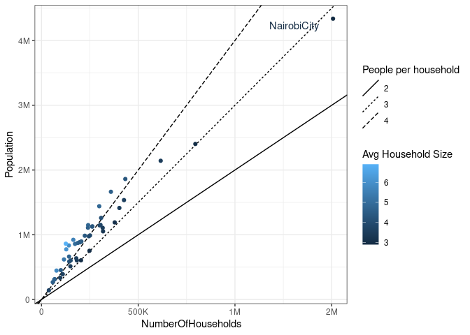

Let's load the data for this week:


```r
tuesdata <- tidytuesdayR::tt_load(2021, week = 4)
```

```
## 
## 	Downloading file 1 of 3: `households.csv`
## 	Downloading file 2 of 3: `crops.csv`
## 	Downloading file 3 of 3: `gender.csv`
```

I am inclined to visualize the crop data on a heatmap. Looks like the production of some crops is concentrated to some regions.


```r
heat_data <- tuesdata$crops %>% 
  filter(SubCounty != "KENYA") %>% 
  select(-SubCounty, -Farming) %>% as.matrix()
rownames(heat_data) <- tuesdata$crops$SubCounty[-1]


ComplexHeatmap::Heatmap(
  heat_data %>% as.matrix() %>% t(),
  na_col = "gray10",
  cluster_columns = FALSE,
  cluster_rows = FALSE,
  name = "Population",
  column_names_rot = 60,
  row_names_side = "right",
  column_names_side = "top", 
  show_heatmap_legend = F, 
  col = c("#148F7A", "white", "#FF9970"),
  column_title = "Kenya's population working in crop production by county" 
)
```

<!-- -->

Using the `households` dataset we can see how the population is distributed at different counties. `NairobyCity` is the most populated. Many counties have households with more than 4 individuals on average.


```r
households <- tuesdata$households %>% 
  mutate(County = str_squish(County))

d=data.frame(slope=c(2,3,4), ic=c(0,0,0))

ggplot(households %>% filter(County!="Kenya"), aes(NumberOfHouseholds, Population, color=AverageHouseholdSize)) +
  geom_abline(data=d, 
            mapping=aes(slope=slope,
                        intercept=ic,
                        linetype=factor(slope)))+
  geom_point() +
  geom_text(data = filter(households,
                          County=="NairobiCity"),
            aes(x = NumberOfHouseholds - 200000,
                y = Population - 100000,
                label=County)) +
  scale_x_continuous(labels = scales::label_number_si()) +
    scale_y_continuous(labels = scales::label_number_si()) +
  labs(linetype="People per household",
       color = "Avg Household Size")
```

<!-- -->

