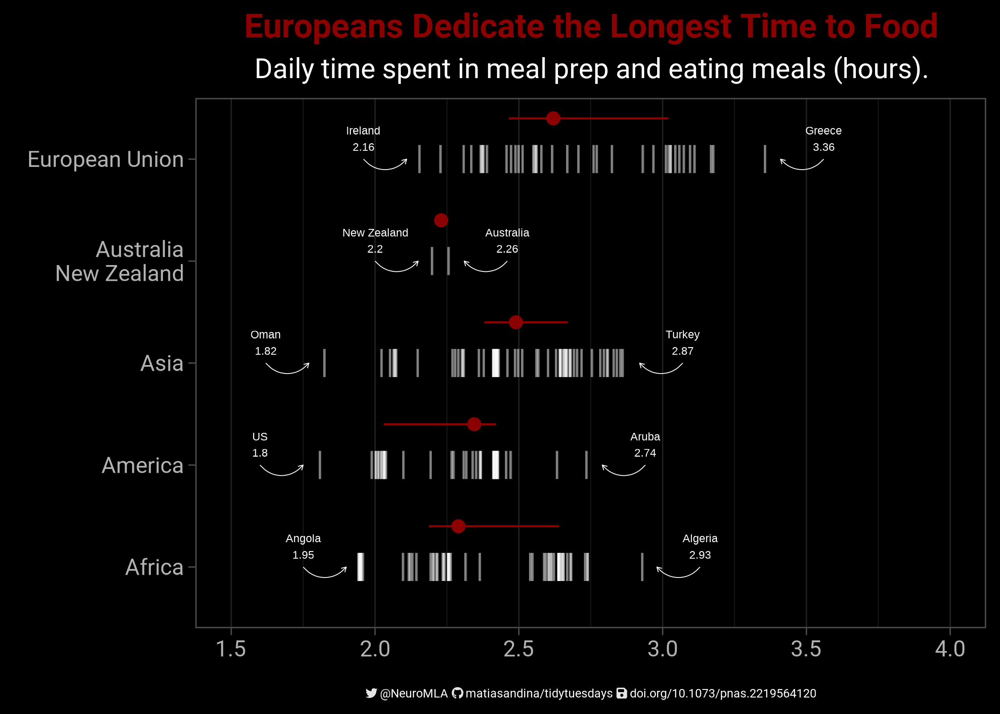
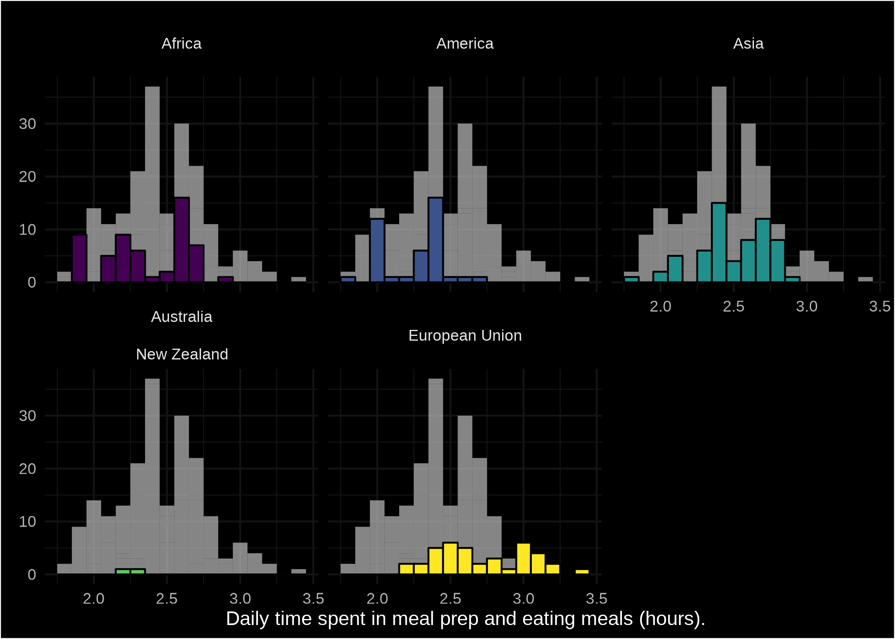

https://github.com/rfordatascience/tidytuesday/tree/master/data/2023/2023-09-12

I recorded the process of making this plot:

I also created an alternative visualization in the form of highlighted histograms

